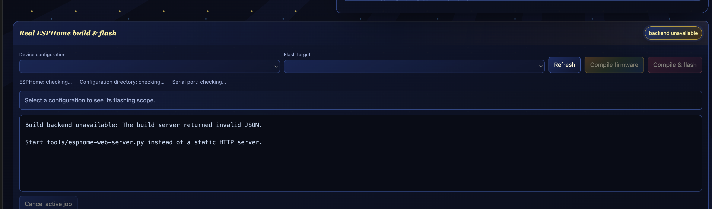
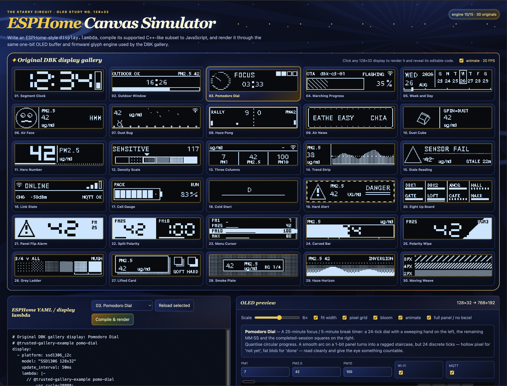
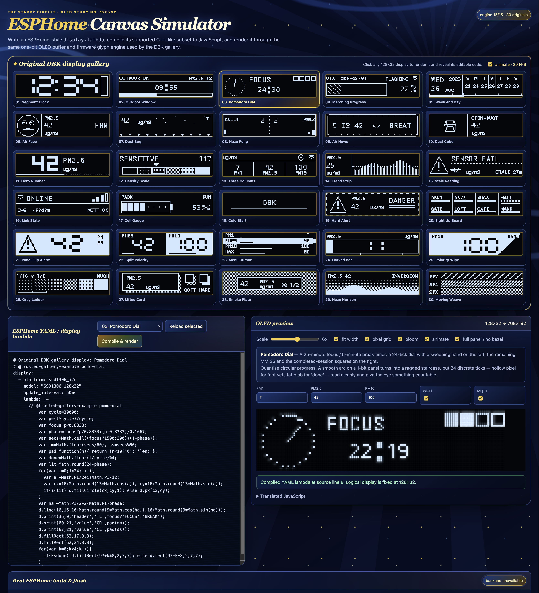

# sim/ — the DBK screen bench

Two ways to look at a 128x32 OLED design before it reaches a child's desk.

| File | What it is |
|---|---|
| `gallery.yaml` | **Device firmware.** All 30 screen designs in one build, cycling every 5s on a real ESP32-C3 + SSD1306. |
| `canvas/*.yaml` | **One installable configuration per browser example.** Three simulator basics plus all 30 gallery screens, each pinned to the selected design. |
| `dbk-sim.yaml` | Host-platform template for `just lab-sim` — renders a device's display lambda to an SDL window, no hardware. |
| `_active-sim.yaml` | Generated. `tools/lab-sim.py` writes it on every run; do not edit. |
| `sim_shim.h` | Stands `wifi_component` up as a shim, because the host platform cannot compile the real WiFi component. |

---

## Build every Canvas example for Web Serial

The public simulator does not compile firmware in the browser. Every selectable
example instead has a checked-in YAML source, a locally compiled ESP32-C3
factory image, and an ESP Web Tools manifest:

```text
sim/canvas/<id>.yaml
site/firmware/canvas/<id>.factory.bin
site/manifests/canvas/<id>.json
```

Generate the 33 standalone YAML files, compile all images locally, and verify the
published set:

```bash
just canvas-generate
ESPHOME_CMD=/path/to/esphome just canvas-build
just canvas-verify
```

`tools/canvas-firmware.py` extracts the three basic lambdas from the browser
simulator and the 30 original C++ lambdas from `gallery.yaml`, so the UI, YAML
catalog, and firmware catalog cannot silently drift apart. Each generated file
contains the full ESP32-C3, sensor, font, and display configuration plus one
direct lambda. It has no `packages`, `!include`, or gallery `switch/case`, and
can be compiled by itself with `esphome compile sim/canvas/<id>.yaml`. The build
is deliberately local; no GitHub Actions firmware workflow is required. The
checked-in `site/firmware/canvas/catalog.json` records the compiler version,
size, and SHA-256 of every image.

---

## What the gallery firmware is

One ESPHome device config holding **thirty** display lambdas in a
`switch (id(screen_idx))`, advanced by a 5-second interval that wraps at 30.

The reason it exists is that a simulator does not prove a font. The four fonts on
this device have hard glyph limits, and a character outside a set renders as a
hollow box **on hardware, silently, with no error and no log**. One compile of
this file exercises every lambda; one flash puts all thirty on real glass, where
a missing glyph is a thing you can actually see.

Design decisions worth knowing before you edit it:

- **No credentials are embedded.** The file is safe to commit and share. Wi-Fi
  is provisioned after flashing through Improv Serial over USB, ESP32 Improv
  over BLE, or the fallback captive portal; ESPHome persists the credentials.
- **Sensor values are network-ready.** `api:` exports PM1, PM2.5 and PM10 to
  Home Assistant over the native ESPHome API. The embedded Web Server v3 also
  exposes a local dashboard, REST JSON, and `/events` SSE; `ota:` and
  `dashboard_import:` let an adopted full config be updated over Wi-Fi.
- **Every factory image has a unique initial node name.**
  `name_add_mac_suffix: true` produces `dbk-canvas-aabbcc`-style names. To choose
  an exact permanent name, import the full YAML into ESPHome Device Builder,
  then follow ESPHome's two-step `esphome.name` / `wifi.use_address` rename.
- **The friendly alias is safe to rename.** It starts as `DBK AABBCC`, is stored
  in flash, and can be changed through the on-device UI or DustBoy telemetry
  dashboard without changing the unique hostname.
- **No PMS7003 required.** Every lambda was audited for the NaN case, so a bare
  C3 + OLED renders all thirty screens with zeros instead of the hollow boxes
  `"nan"` would produce in `font_value`.
- **The clock has honest fallbacks.** Before Wi-Fi is provisioned, screens 0 and
  4 show `09:41` and `WED 26 AUG 2026`; after provisioning they use SNTP time.
- **Nothing is overlaid on a design.** No screen number is painted on top — each
  renders exactly as drawn. The only screen that shows an index is the `default:`
  case, which is reached only if `screen_idx` goes out of range.
- **One block is gallery-only** and clearly marked: an interval that toggles
  `mqtt_connected` every ~17s. Without it that global sits false forever and the
  connected branches of screens 12 and 19 never appear. Delete the block to make
  the gallery purely passive.

### Make it reachable from the lab dir

Both `just lab-sim` and `just lab-gallery-flash` work out of `$LAB_DIR`
(default `~/.haos-oracle/lab`), not out of this repo. Link it once:

```bash
ln -sfn "$PWD/sim/gallery.yaml" ~/.haos-oracle/lab/gallery.yaml
```

`just lab-guard` gitignores `*.yaml` in that directory, so the link never gets
committed alongside the resolved configs that do hold secrets.

---

## Render it (no hardware)

```bash
just lab-sim gallery
```

This lifts the display lambda out of `gallery.yaml`, grafts it into
`dbk-sim.yaml`, compiles it natively and opens an SDL window. It is ESPHome's own
renderer running the same lambda text that compiles to firmware — not a port and
not an approximation. `dbk-sim.yaml` carries a `screen_idx` global and a matching
5s interval so the simulator walks the same thirty designs in the same order, and
a driver interval sweeps PM2.5 from 0 to 160 so every layout gets exercised at
one, two and three digits.

```bash
just lab-sim-build gallery    # compile only — "does it build", no window
```

---

## Flash it

> **Free the serial port first.** Anything holding it makes the board invisible
> and the flash dies with a confusing *"no serial data received"*. Two things
> hold it: an `esphome logs` session, and the DBK **serial-to-MQTT bridge**.
>
> The bridge is the one that bites. It has **no reconnect**, and it **latches a
> retained `offline`** when it is killed. Tear it away mid-flash and Home
> Assistant keeps showing the board as offline until a human notices and restarts
> it. Stopping it on purpose and putting it back is strictly better than letting
> esptool rip it away.

```bash
just lab-free                 # stop the logger and the bridge — ALWAYS FIRST
just lab-build gallery        # a real compile; `esphome config` proves nothing
just lab-gallery-flash        # runs lab-free itself, then uploads
```

Afterwards, if this board feeds Home Assistant, **restart the bridge** and then
confirm HA actually recovered:

```bash
just states dbk               # read HA back — the bridge's own log only proves it published
```

One-shot alternative (compile + upload + follow logs):

```bash
just lab-flash gallery
```

### If the panel reads upside down

`gallery.yaml` sets `flip_x: true` / `flip_y: true` to match `dbk.yaml` — the DBK
enclosure mounts the SSD1306 inverted. On a bare breadboard, drop both lines.
They are a hardware remap; no lambda coordinate changes.

### If the animations look frozen

`update_interval: 1s` matches the shipped DBK firmware, and it is the budget the
per-pixel screens were designed against (screen 27 scans all 4096 pixels). The
cost is that the `millis()`-driven motion — marching OTA stripes, the news
ticker, Haze Pong, the seconds column — steps once per second instead of moving.
Set it to `50ms` to watch them run. Every screen still fits the frame budget on a
C3 except 27, which will begin to stutter. That is a viewing choice, not a design
change. (The same applies to `dbk-sim.yaml` for the SDL window.)

### Provision Wi-Fi and choose a name

After Web Serial flashing, keep the USB cable connected and let ESP Web Tools
send the SSID/password through **Improv Serial**. BLE Improv and the
`DBK-Canvas Setup` captive portal are fallback paths. Home Assistant then
discovers the unique `dbk-canvas-<mac>` node and receives its PM entities.

The public [Wi-Fi setup page](../site/wifi/index.html) performs this as a
separate, stable-port step. After provisioning, the [telemetry dashboard](../site/dashboard/index.html)
reads the on-device Web API directly and can persist the `DBK <suffix>` alias.

Improv provisions network credentials; it does not rewrite ESPHome's compiled
node name. For a custom name, use the YAML icon beside the preview, import that
complete file into ESPHome Device Builder, change `esphome.name`, and temporarily
set `wifi.use_address` to the board's current name or IP for the first OTA upload.
Remove `use_address` and upload again after the new name is live. Never inline
real Wi-Fi values in the public YAML files.

---

## The four fonts — glyph coverage is a hard limit

`ignore_missing_glyphs: false` everywhere, so a bad glyph is caught at **compile**
time rather than on a desk. That safety net only covers *string literals*; a
character that arrives at runtime through `printf` is not checked by anything.

| Font | Face | Coverage |
|---|---|---|
| `font_header` | Roboto Mono 10px | 116 glyphs — full ASCII + typographic extras |
| `font_label` | Roboto Mono 7px | 116 glyphs — full ASCII + typographic extras |
| `font_value` | Open Sans 10px | **only `" 0123456789"`** |
| `font_icons` | Material Design Icons 10px | **only U+F05A9 (wifi) and U+F05AA (wifi-off)** |

**`font_value` is where designs die.** It has no `.`, no `-`, no `:`, no `%`, and
no letters. Consequences, all of them load-bearing in these thirty screens:

- `printf("%.1f", …)` emits a `.` → hollow box. Use `"%.0f"`.
- A negative value emits `-` → hollow box. Clamp before you format.
- **`id(pms_pm25).state` is `NaN` before the sensor's first frame**, and
  `printf("%.0f", NAN)` emits the three *letters* `nan` → three hollow boxes,
  during boot and during exactly the sensor failure your error screen is for.
  Guard with `if (!(v >= 0.0f)) v = 0.0f;` — that form catches NaN too, where
  `if (v < 0)` does not, because every comparison against NaN is false.
- `%`, `:` and `°` have to be drawn with primitives. Several screens do exactly
  that, and those hand-built glyphs are not decoration — do not "simplify" them
  back into a printed character.
- Anything with a letter in it (`PM2.5`, `ug/m3`, `STALE 27m`, `CH6 -58dBm`)
  belongs in `font_label` or `font_header`. Both are full ASCII, so `.` `/` `-`
  are real glyphs *there*.
- `ug/m3` must stay ASCII. The tempting `µg/m³` is two missing glyphs.

Inverse and dither are first-class on this panel and used throughout: `COLOR_OFF`
*clears* pixels rather than skipping them, so a filled block plus `COLOR_OFF` on
top carves text out of the fill — the only way to make a label invert with its
background, since `it.print` can only add ink. Dithering on a checkerboard
produces an apparent grey the panel physically cannot make.

---

## The thirty screens

| # | id | Name |
|---:|---|---|
| 0 | `seg-clock` | Segment Clock |
| 1 | `outdoor-countdown` | Outdoor Window |
| 2 | `pomo-dial` | Pomodoro Dial |
| 3 | `ota-marching` | Marching Progress |
| 4 | `week-and-day` | Week and Day |
| 5 | `mood-face` | Air Face |
| 6 | `dust-bug` | Dust Bug |
| 7 | `haze-pong` | Haze Pong |
| 8 | `air-news-ticker` | Air News |
| 9 | `dust-cube` | Dust Cube |
| 10 | `hero-pm25` | Hero Number |
| 11 | `aqi-band` | Density Scale |
| 12 | `triple-metric` | Three Columns |
| 13 | `trend-strip` | Trend Strip |
| 14 | `sensor-stale` | Stale Reading |
| 15 | `link-state` | Link State |
| 16 | `cell-gauge` | Cell Gauge |
| 17 | `cold-start` | Cold Start |
| 18 | `hard-alert` | Hard Alert |
| 19 | `eight-up-board` | Eight Up Board |
| 20 | `flip-alarm` | Panel Flip Alarm |
| 21 | `split-polarity` | Split Polarity |
| 22 | `menu-cursor` | Menu Cursor |
| 23 | `carve-bar` | Carved Bar |
| 24 | `wipe-invert` | Polarity Wipe |
| 25 | `grey-ladder` | Grey Ladder |
| 26 | `lifted-card` | Lifted Card |
| 27 | `smoke-plate` | Smoke Plate |
| 28 | `haze-horizon` | Haze Horizon |
| 29 | `moving-weave` | Moving Weave |

Screens 20-24 build a 512-byte bit-packed mask in `static` (BSS, not the display
task's stack) and replay it through `COLOR_OFF`, because carving is the only way
to invert type. Screens 25-29 are dither studies. Everything from 20 up avoids
the real fonts almost entirely and draws its own 3x5 micro-font, for the same
reason: `it.print` cannot knock text out of a filled block.

## Captured archive view

The public GitHub Pages copy is a static archive. Its native ESPHome build controls are intentionally disabled because Pages cannot run the localhost build server. Use the release flasher from the main site for USB flashing, or run `tools/esphome-web-server.py` locally when you need compile/flash controls.



## Captured 30-screen gallery

This is the archived simulator view showing all thirty original DBK OLED designs, the editable ESPHome `display:` lambda panel, and the live 128×32 preview. The same gallery is available at the deployed Pages archive:

https://dustboy-kit.github.io/esp32c3-pm25-monitor/tools/esphome-canvas-simulator.html



## Full-page simulator capture

A full-page capture of the archived simulator, including the 30-screen gallery, editable YAML panel, OLED preview, and archive build/flash notice:


